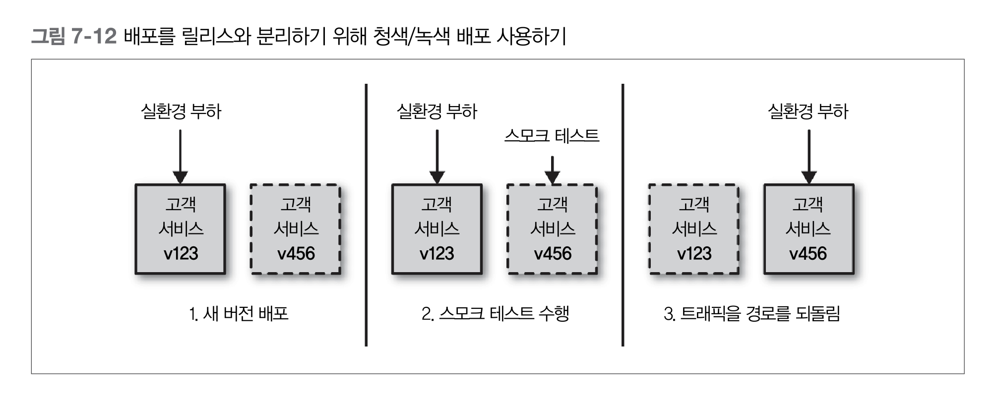

# 7.테스팅  

세분화된 시스템의 테스팅과 관련된 문제를 해결하고, 새로운 기능을 자신있게 릴리스 할 수 있는 해결책을 알아본다  

-  performance test  
- unit test  
- UI end-to-end test

## Unit Test  
일반적으로 단일 함수 또는 메서드 호출을 테스트하는 것  
**기능의 정상 동작 유무에 대한 매우 빠른 피드백**  
코드를 재구성하게 해주며, 작은 범위의 테스트들이 우리의 실수를 잡아주기 때문에  
코드의 리팩토링을 지원하는 데 있어 중요  
문제를 신속히 발견하고 해결하기 위해 테스트를 더욱 격리하기 위함  
격리를 위해 모든 외부 협업자를 스텁으로 만들어 오직 서비스 자체의 범위만으로 제한  

## End-to-end Test 
이 테스트에서 그 스텁에 반복해서 요청하는 것은 상관하지 않음  
테스트의 변형은 스텁 대신 목(mock)을 사용하는 것. 
fake, spy, dummy와 같은 용어를 남용할 때 더욱 혼란 스러움  
마틴 파울러는 스텁과 목을 포함한 이 모든 것을 test double이라고 부름  
 
## 신뢰할 수 없고 취약한 테스트  
테스트에서 비결정적 요소 근절하기. 
신뢰할 수 없는 테스트가 있다면 그것을 찾아내고, 즉시 해결할 수 없다면 테스트 집합에서 제거하여 치료하는 방식을 강조  
- 여러 스레드에서 수행되는 테스팅 코드를 피하기 위해 테스트를 재작성할 수 있는지 살펴 보라   
- 하부 환경을 더욱 안정적으로 만들 수 있는지 살표 보라  
- 신뢰할 수 없는 테스트를 문제 가능성이 낮은 작은 범위의 테스트로 교체할 수 있는지 살펴 보라  

## 테스트 작성 전담 팀은 재앙  
소프트웨어를 개발하는 팀은 그들의 코드에 대한 테스트와 점차 멀어지고  
서비스 소유자들은 방금 개발한 기능의 End-to-end 테스트를 테스트 팀이 작성할 때까지 기다려야 하므로 주기 시간이 증가함  
다른 팀에 이 테스트를 작성하기 때문에 서비스를 개발했던 팀은 덜 참여하게 되고 이들 테스트를 어떻게 고치는지 모르기 쉬움  
개발팀이 처음 작성한 코드의 테스트를 작성하는 것에서 멀어질 때마다 상당한 피해가 발생  

## CDC/Consumer-driven contract. 
언어 중릭적인 JSON 명세서의 사용은 좋은 아이디어  
JSON 팩트 명세서는 소비자에 의해 생성되기 때문에 생산자 빌드가 접근할 수 있는 산출물이 될 필요가 있음  
CI/CD 도구가 사용하는 산출물 저장소에 이것을 저장할 수 있고  
여러 버전의 팩트 명세서를 저장할 수 있는 Pact Broker를 사용할 수 있음. 

## 배포와 릴리스 분리하기  
### smoke test   
- 소프트웨어를 배포해 **실환경 부하를 주기 전에 배포한 곳에서 테스트** 할 수 있다면 특정 환경에서 이슈를 발견할 수 있음     
- 릴리스할 소프트웨어를 거부할 만큼 심각하면서 단순한 장애를 확인하는 예비 테스트  
- 컴포넌트나 시스템의 가장 중요한 기능이 동작하는지에 중점  
- 제대로 배포되었는지 보장하기 위해 새롭게 배포된 소프트웨어에 대해 수행하도록 설계된 테스트의 집합  
- 이 테스트는 지역적 환경 문제를 발견하는데 도움   
- 특정 마이크로서비스를 배포하기 위해 단일 명령행 명령어를 사용하고 있다면 스모크 테스트를 자동적으로 수행해야 함. 
  
 
### green/blue deployment  
동시에 배포된 두 개의 소프트웨어 복제본 중에서 한 버전만 실제 요청을 처리  
  
- 실환경 트래픽을 다른 호스트(또는 호스트의 집합)로 향하게 할 수 있어야 함  
	- DNS엔트리를 변경하거나 부하 분산 설정(load-balancing configuration)을 변경하는 식으로 가능  
- 한번에 두 버전의 마이크로서비스를 프로비저닝할 수 있어야 함  
	- 탄력적인 클라우드 제공자(elastic cloud provider)를 사용하면 간단한 일  
- 청색/녹색 배포의 사용은 배포의 위험을 낮출 뿐만 아니라 문제가 발생했을 때 되돌릴 기회를 주는 것   
- 이 방식에 능숙하다면 전체 프로세스가 사람의 개입이 전혀 없이도 모든 전개와 복귀가 자동화될 수 있음  
- 실환경 트래픽을 보내기 전에 서비스를 그 자리에서 테스트할 수 있는 이점은 제쳐두더라도, 릴리스 작업을 수행하는 동안 과거 버전을 유지함으로써 소프트웨어 릴리스와 관련된 시스템의 정지 시간을 크게 낮출 수 있음    
- 트래픽 경로 변경을 구현한 메커니즘 종류에 따라 무중단 배포(zero downtime deployment)를 제공하면서 버전 간 전환을 고객에게 완전히 감출 수 있음  

## Canary Release   
카나리아 릴리스를 했을 때 시스템이 예상대로 수행하는지 보기 위해 실환경 트래픽을 유입시켜 새롭게 배포된 소프트웨어를 검증  
- 새 릴리스가 잘못되었다면 신속히 되돌려야 함   
- 새 릴리스가 정상이라면 늘어나는 트래픽이 새 버전에 유입되도록 해야함   
  
_카나리아 릴리스는 버전들이 더 오래 공존시킬 수 있고 트래픽의 양을 자주 변경할 수 있다는 점에서 green/blue release와 차이가 있음_    
  
**장점**  
- 나쁜 릴리스의 출시 위험을 관리할 도구를 제공하며   
- 실제 트래픽으로 새 버전의 소프트웨어를 검증할 수 있게 함   

**단점**  
- 하지만 green/blue release 배포보다 복잡한 설정과 약간의 사고를 더 필요로 함    
- 서로 다른 버전의 서비스가 green/blue release보다 더 오랜 기간 공존할 것이 예상되므로 이전보다 더 많은 하드웨어를 점유할 수 있음   
- 새로운 릴리스의 동작을 확신하기 위해 트래픽 비율을 조정해야 하기 때문에 더 정교한 트래픽 라우팅도 필요  
- 하지만 이미 green/blue release를 다루고 있다면 필요한 구성 요소 일부는 이미 갖춘 셈   

### 넷플릭스 사례   
- 릴리스에 앞서 실환경과 동일한 버전을 표현하는 기반 클러스터에 새로운 서비스 버전이 함 께 배포  
- 그다음에 수 시간 동안 새 버전과 기반버전 양쪽에 실환경의 부하 일부를 주면서 측정   
- 카나리아 릴리스가 테스트를 통과하고 나면 넷플릭스는 실환경에 전체 전개를 진행   

 
---
**TDD(Test Driven Design)**   
매우 짧은 개발 사이클을 반복하는 소프트웨어 개발 프로세스 중 하나이다.  
개발자는 먼저 요구사항을 검증하는 자동화된 테스트 케이스를 작성한다.  
그런 후에, 그 테스트 케이스를 통과하기 위한 최소한의 코드를 생성한다.  
마지막으로 작성한 코드를 표준에 맞도록 리팩토링한다.  
이 기법을 개발했거나 '재발견' 한 것으로 인정되는 Kent Beck은 2003년에 TDD가 단순한 설계를 장려하고 자신감을 불어넣어준다고 말하였다. (출처: 위키백과)  

**Stub**  
테스트 중인 시스템의 외부 의존성이나 협업자를 대체하는 모의 구현  
다른 컴포넌트와의 로직을 독립적으로 검증하게 함  

**Anti pattern**  
실제 많이 사용되는 소프트웨어 패턴이지만 비효율적이거나 비생산적인 패턴  

**test double**  
테스팅 목적으로 실제 컴포넌트나 객체를 대신하는 것을 총칭  
마틴 파울러의 글에서 더미 객체, 각짜 객체, 스텁 스파이, 목에 대해 설명하고 있음   

**Selenium Grid**  
2008년 소트워크스의 필립 핸리고가 허브를 통해 다수의 노드를 제어하여 병렬 테스트가 가능하도록 셀레니움의 기능을 확장한 것  

